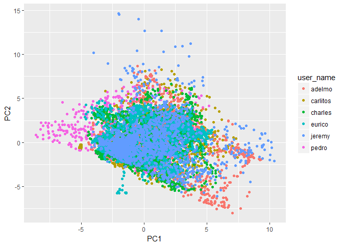
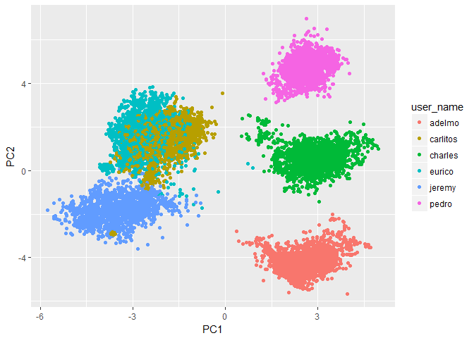

# Research on "How Well Your Exercises Are"

### Introduction
The data for this project come from [Human Activity Recognition (HAR)](http://web.archive.org/web/20161224072740/http:/groupware.les.inf.puc-rio.br/har). Thank you for data sharing!  
The training data for this project are available [here](https://d396qusza40orc.cloudfront.net/predmachlearn/pml-training.csv).  
The test data are available [here](https://d396qusza40orc.cloudfront.net/predmachlearn/pml-testing.csv).  
**Reference**    
Velloso, E.; Bulling, A.; Gellersen, H.; Ugulino, W.; Fuks, H. Qualitative Activity Recognition of Weight Lifting Exercises. Proceedings of 4th International Conference in Cooperation with SIGCHI (Augmented Human '13) . Stuttgart, Germany: ACM SIGCHI, 2013. 

### Executive Summary
The workflow of this project is described as below:   

1. Data Download;
2. Data load and cleaning;  
3. Data standardization;  
4. Exploratory analysis;  
5. Build predictive model with training dataset using random Forest;  
- First, we decide to Normalize the training dataset based on individuals to eliminate the influence from person;   
- Second, we used RandomForest algorithm to train a model based on Training Dataset;  
- Third, we used the trained model to predict normalized validating dataset and draw the confusion matrix;    
*Since the performance on the validation dataset is quite good as performed, we didn't fine tuning our predictive model any more.*   

6. Predict Testing (20) samples.  

 

**Conclusion:**  
The Accuracy based on validation dataset is `0.992`, which indicate the model performance is pretty good.  
The prediction result of 20 extra samples are shown at the last section and past the following exam.  

### Data Download

```r
rm(list=ls())
if (!file.exists('./PA_train.csv')){
  file_url <- 'https://d396qusza40orc.cloudfront.net/predmachlearn/pml-training.csv'
  download.file(file_url,'./PA_train.csv')
}
if (!file.exists('./PA_test.csv')){
file_url <- 'https://d396qusza40orc.cloudfront.net/predmachlearn/pml-testing.csv'
download.file(file_url,'./PA_test.csv')
}
```

### Data Load and standardization

```r
training <- read.csv('PA_train.csv',na.strings = c("","NA"))
testing <- read.csv('PA_test.csv',na.strings = c("","NA"))
# filter out new Window data in training set (which is not contained in test dataset)
training <- training[training$new_window=="no",]
# find features without nzv values
nzv <- nearZeroVar(training, saveMetrics = T)
training <- training[,nzv$nzv=="FALSE"]
testing <- testing[,nzv$nzv=="FALSE"]
# remove non feature columns, like time=stamp, user-id, name, etc.
nonfeat_col <- c(1,3,4,5,6)
training_fin <- training[,-nonfeat_col]
testing_fin <- testing[,-nonfeat_col]
# A glance on the dataset
head(training_fin[,c(1:4,ncol(training_fin))])
```

```
##   user_name roll_belt pitch_belt yaw_belt classe
## 1  carlitos      1.41       8.07    -94.4      A
## 2  carlitos      1.41       8.07    -94.4      A
## 3  carlitos      1.42       8.07    -94.4      A
## 4  carlitos      1.48       8.05    -94.4      A
## 5  carlitos      1.48       8.07    -94.4      A
## 6  carlitos      1.45       8.06    -94.4      A
```

### Data normalization

```r
set.seed(1122) # fix random seed for reproducible reason
performance_metrics=NULL
inTraining <- sample(nrow(training_fin), 0.6*nrow(training_fin))
data_train <- training_fin[inTraining,]
data_validation <- training_fin[-inTraining,]
# Data scaling based on each individuals
person_name = unique(training_fin$user_name)
data_train_norm_all = NULL
data_vali_norm_all = NULL
data_test_norm_all = NULL
for (i in 1:length(person_name)){
  norm_proc = preProcess(data_train[data_train$user_name==person_name[i],],method = c("center", "scale"))
  data_train_norm = predict(norm_proc, data_train[data_train$user_name==person_name[i],])
  data_vali_norm  = predict(norm_proc, data_validation[data_validation$user_name==person_name[i],])
  data_test_norm = predict(norm_proc, testing_fin[testing_fin$user_name==person_name[i],])
  data_train_norm_all = rbind(data_train_norm_all, data_train_norm)
  data_vali_norm_all = rbind(data_vali_norm_all, data_vali_norm)
  data_test_norm_all = rbind(data_test_norm_all, data_test_norm)
}
```

### Explortary Analysis
With the PCA plot(*Appendix Plot-1*), we can see the training samples are well distributed across the axis and were not significantly separated by individuals.  

We Need to Make sure that individual influence didn't influence the dataset. if we not doing this step, the predicting performance would be heavily influenced. See *Appendix Plot-2*.


### Build Random Forest Model 

```r
# build random Forest Model
model_rf = randomForest(classe~., data=data_train_norm_all)
```
### Evaluate Model Performance on Validating Dataset

```r
# do prediction
pred_rf = predict(model_rf, data_vali_norm_all)
# Get performance in general
c1 = confusionMatrix(pred_rf, data_vali_norm_all$classe)
c1$table
```

```
##           Reference
## Prediction    A    B    C    D    E
##          A 2223    9    0    0    0
##          B    3 1435   14    0    2
##          C    0    2 1363   16    2
##          D    0    0    2 1215    7
##          E    0    0    0    1 1393
```

```r
c1$overall
```

```
##       Accuracy          Kappa  AccuracyLower  AccuracyUpper   AccuracyNull 
##      0.9924548      0.9904421      0.9902569      0.9942658      0.2895798 
## AccuracyPValue  McnemarPValue 
##      0.0000000            NaN
```
### Predict extra samples

```r
pred_test = predict(model_rf, data_test_norm_all)
result_matrix = as.matrix(pred_test)
result_matrix[order(as.integer(rownames(result_matrix))),]
```

```
  1   2   3   4   5   6   7   8   9  10  11  12  13  14  15  16  17  18 
"B" "A" "B" "A" "A" "E" "D" "B" "A" "A" "B" "C" "B" "A" "E" "E" "A" "B" 
 19  20 
"B" "B" 
```
  

###  Appendix Plot-1

```r
# Principal Component extraction  
pcn_proc = preProcess(data_train_norm_all, method= "pca", thresh=.9)
data_train_pc = predict(pcn_proc, data_train_norm_all)
data_vali_pc = predict(pcn_proc, data_vali_norm_all)
data_test_pc = predict(pcn_proc, data_test_norm_all)
g <- ggplot(data_train_pc, aes(x=PC1, y=PC2)) + geom_point(aes(color=user_name))
g
```

<!-- -->

### Appendix Plot-2
If we didn't consider the personal difference, the dataset would cluster like following:  

```r
norm_proc_2 = preProcess(data_train,method = c("center", "scale","pca"))
data_train_norm_2 = predict(norm_proc_2, data_train)
g <- ggplot(data_train_norm_2, aes(x=PC1, y=PC2)) + geom_point(aes(color=user_name))
g
```

<!-- -->
